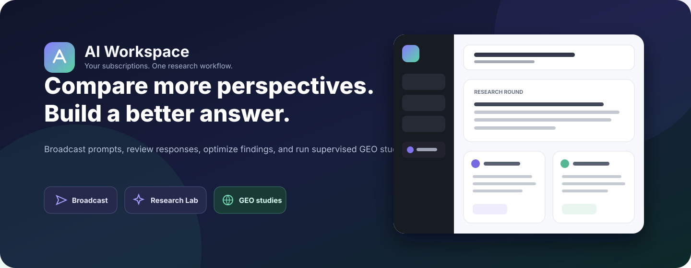
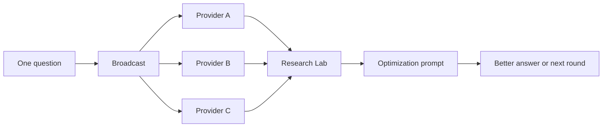

<div align="center">



<br />

[](https://github.com/BlockFrame/AI-workspace/actions/workflows/build.yml)
[](./LICENSE)
[](https://www.electronjs.org/)
[](https://react.dev/)
[](https://www.typescriptlang.org/)
[](#platform-support)

**A local-first desktop workspace for using multiple AI subscriptions as one repeatable research system.**

[Get started](#quick-start) · [Features](#what-you-can-do) · [Architecture](./docs/architecture.md) · [Workflows](./docs/workflows.md) · [Security](./SECURITY.md)

</div>

---

## Why AI Workspace?

AI Workspace is designed for a practical workflow: ask the same question to several AI
providers, inspect their different answers, combine the strongest evidence, and continue
working from a better result.

It wraps official provider websites in isolated desktop sessions. It does **not** require a
shared AI Workspace account, cloud backend, or hidden synthesis model.



## What you can do

| Area | Purpose |
| --- | --- |
| **Multi-account workspace** | Keep independent signed-in sessions for multiple accounts and providers. |
| **Broadcast** | Deliver one prompt to selected provider accounts using Standard or provider-supported Deep Research modes. |
| **Research Lab** | Paste and compare responses, select useful sources, write notes, generate an editable optimization prompt, and continue through linked rounds. |
| **Use Cases / GEO** | Import CSV or TXT question sets, run supervised provider batches, capture new answers and citations, and review a question-by-provider matrix. |
| **Prompt library** | Save reusable templates with `{{variables}}`, preview substitutions, and apply them explicitly to Broadcast. |
| **Local context and history** | Keep opt-in account context, prompt history, schedules, and local usage summaries. |
| **Data protection** | Detect common sensitive-data patterns locally before a prompt is sent. |
| **Accessible desktop UI** | Collapsible navigation, responsive layouts, light/dark themes, high contrast, reduced motion, text scaling, and application zoom. |

### Supported providers

| Provider | Embedded session | Broadcast adapter | GEO capture |
| --- | :---: | :---: | :---: |
| ChatGPT | Yes | Yes | Supervised |
| Claude | Yes | Yes | Supervised |
| Perplexity | Yes | Yes | Supervised |
| Gemini | Yes | Yes | Supervised |
| Z.AI | Yes | Yes | Supervised |
| DeepSeek Chat | Yes | Yes | Supervised |
| Kimi Chat | Yes | Yes | Supervised |
| Mistral Vibe | Yes | Yes | Supervised |

Provider websites change independently. Adapter compatibility must therefore be verified
against authenticated accounts before each release.

## Product boundaries

AI Workspace deliberately keeps different workflows separate:

- **Normal browsing** does not collect provider responses.
- **Broadcast** inserts and submits prompts but reports delivery status only.
- **Research Lab** stores only text the user explicitly pastes.
- **GEO** is the explicit exception: after a user starts a supervised study, it captures only
  the new responses produced for that study.
- **No AI Workspace cloud** receives prompts, responses, cookies, or analytics.
- **No token or billing estimates** are inferred from subscription websites.

Read the complete [privacy and security model](./docs/privacy-and-security.md).

## Quick start

### Requirements

- Node.js 20 or 22
- npm
- Git
- A supported desktop OS

### Run from source

```bash
git clone https://github.com/BlockFrame/AI-workspace.git
cd AI-workspace
npm ci
npm run dev
```

The development command starts Vite, the Electron main-process TypeScript watcher, and
Electron together.

### Validate a change

```bash
npm run typecheck
npm run build
```

### Build an installer

```bash
# Current operating system
npm run package

# Explicit targets
npm run package:win
npm run package:mac
npm run package:linux
```

Generated packages are written to `release/`.

## Core workflows

### Compare and improve answers

1. Connect at least two provider accounts.
2. Open **Broadcast** and send the same question.
3. Copy the relevant provider answers into a **Research Lab** round.
4. Select the strongest responses and add review notes.
5. Generate an editable optimization prompt.
6. Send it to the preferred provider and save the improved answer.
7. Add a linked round when the research needs to continue.

### Run a GEO study

1. Open **Use Cases** and select **GEO visibility study**.
2. Import a CSV/TXT file or paste one question per line.
3. Select provider accounts and choose Standard or Deep Research mode.
4. Keep the app open while questions run sequentially.
5. Review captured responses, citations, blocks, and uncertain results.
6. Correct results manually where needed and mark verified answers.

See [Workflow guide](./docs/workflows.md) for file formats, state transitions, and operational
limits.

## Keyboard and zoom

| Action | Windows / Linux | macOS |
| --- | --- | --- |
| Connect an account | `Ctrl+N` | `Command+N` |
| Open Settings | `Ctrl+,` | `Command+,` |
| Open provider 1-8 | `Ctrl+1` ... `Ctrl+8` | `Command+1` ... `Command+8` |
| Zoom interface in/out | `Ctrl++` / `Ctrl+-` | `Command++` / `Command+-` |
| Reset interface zoom | `Ctrl+0` | `Command+0` |

Interface zoom is persisted from 75% to 200% and triggers responsive reflow. Provider-page
zoom remains a separate per-account setting.

## Platform support

| Platform | Package formats | CI build |
| --- | --- | :---: |
| Windows x64 | NSIS `.exe` | Yes |
| macOS x64 / Apple Silicon | `.dmg`, `.zip` | Yes |
| Linux x64 | `.AppImage`, `.deb`, `.tar.gz` | Yes |

Packages are currently unsigned. macOS notarization and production signing require project
credentials and are intentionally not configured in the repository.

## Sign-in limitations

Google can reject OAuth inside embedded desktop browsers. AI Workspace keeps the Google option
available and applies the same browser identity to provider views and authentication popups. If
Google still rejects the flow, use Perplexity's email verification with the same Gmail address.

The same error in a normal Chrome/Edge window may instead indicate a corporate firewall, proxy,
security product, or Google Workspace policy. An external browser session cannot currently be
imported safely into the isolated Electron session.

## Repository map

```text
.
|-- electron/
|   |-- main.ts                 # trusted orchestration, stores, provider views
|   |-- preload.ts              # contextBridge and typed IPC implementation
|   |-- research-store.ts       # Research Lab persistence and validation
|   `-- geo-store.ts            # GEO persistence and state transitions
|-- src/
|   |-- renderer/
|   |   |-- App.tsx             # desktop shell, Broadcast, Settings
|   |   |-- ResearchWorkspace.tsx
|   |   |-- UseCasesWorkspace.tsx
|   |   `-- styles.css
|   `-- shared/
|       |-- types.ts            # DesktopApi and shared contracts
|       |-- services.ts         # provider registry
|       |-- research-types.ts
|       |-- geo-types.ts
|       |-- geo-import.ts
|       `-- sensitive-data.ts
|-- docs/
|   |-- architecture.md
|   |-- workflows.md
|   |-- privacy-and-security.md
|   `-- assets/
|-- .github/workflows/          # CI and tagged releases
`-- package.json
```

## Documentation

- [Architecture](./docs/architecture.md) - process boundaries, IPC, persistence, and runtime flows
- [Workflow guide](./docs/workflows.md) - Broadcast, Research Lab, GEO, and authentication
- [Privacy and security](./docs/privacy-and-security.md) - data handling, threat boundaries, and reporting
- [Contributing](./CONTRIBUTING.md) - development and provider-adapter guidance
- [Changelog](./CHANGELOG.md) - released and unreleased changes
- [Security policy](./SECURITY.md) - supported versions and private reporting

## Known constraints

- Provider DOM changes can break prompt or capture selectors.
- GEO is intentionally sequential and supervised; it is not a high-volume crawler.
- Scheduled prompts run only while AI Workspace is open.
- Subscription web apps do not expose reliable token or billing information.
- Google OAuth may still reject an embedded provider session and requires manual compatibility testing.
- Real provider compatibility requires manual testing with authenticated accounts.

## Contributing

Contributions are welcome. Start with [CONTRIBUTING.md](./CONTRIBUTING.md), keep changes focused,
and run:

```bash
npm run typecheck
npm run build
```

For vulnerabilities, follow [SECURITY.md](./SECURITY.md) instead of opening a public issue.

## License

Released under the [MIT License](./LICENSE).
