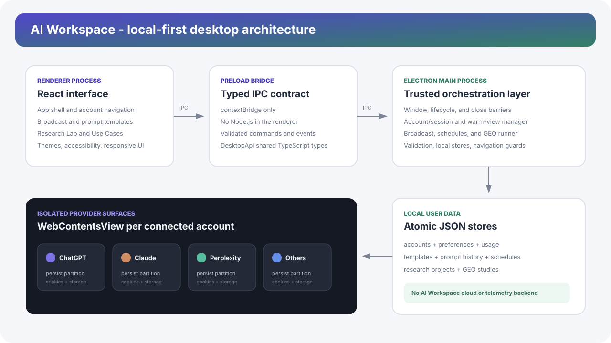
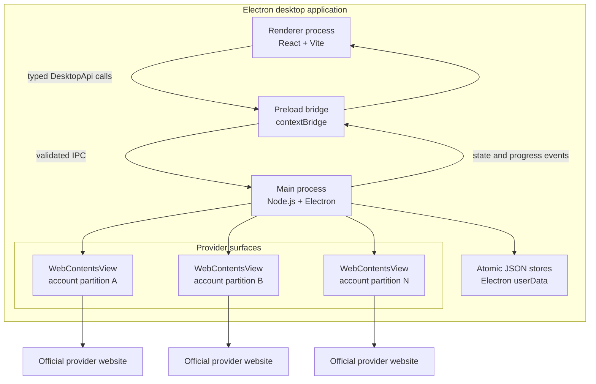
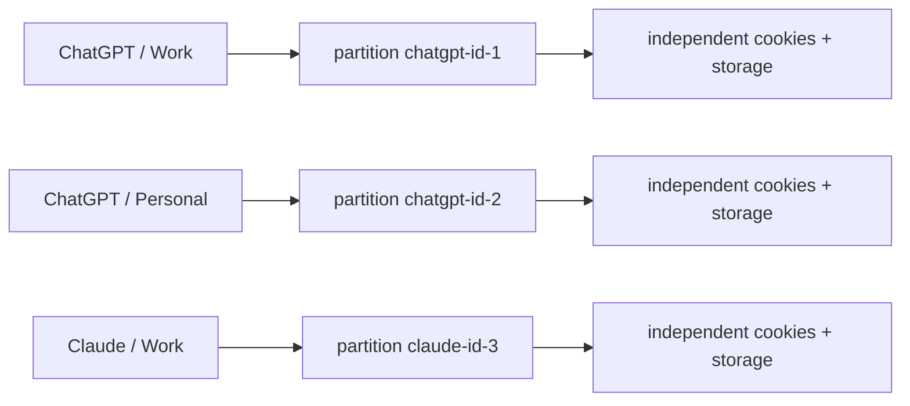
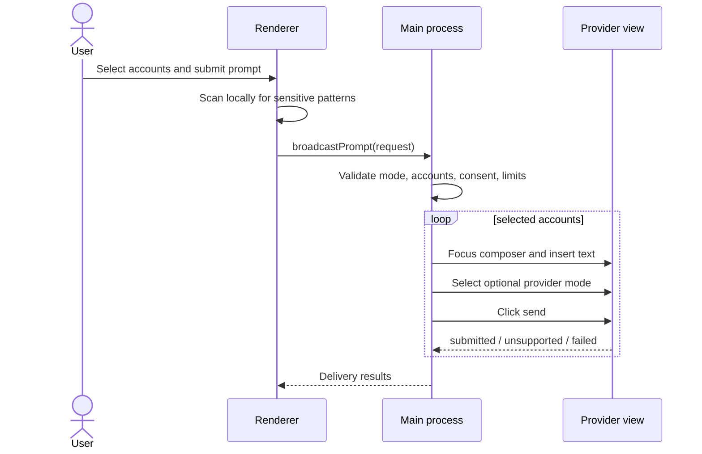
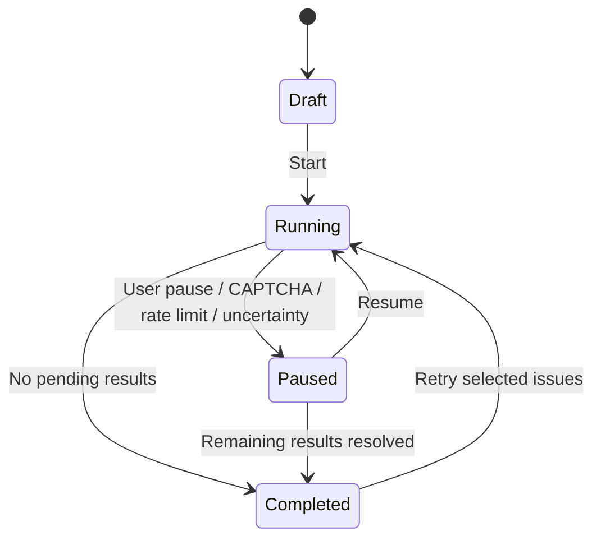
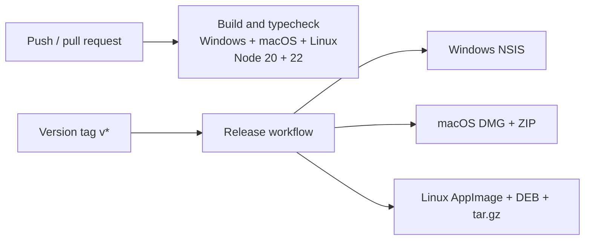

# Architecture

This document describes the current AI Workspace implementation. It focuses on trust
boundaries, runtime ownership, local persistence, and the behavior that future changes must
preserve.

<p align="center">
  
</p>

## Architectural goals

1. **Use existing subscriptions:** providers remain their official web applications.
2. **Keep accounts isolated:** each connected account owns a persistent Chromium partition.
3. **Stay local-first:** AI Workspace has no application backend or telemetry collector.
4. **Make automation explicit:** Broadcast and GEO run only after direct user actions.
5. **Keep privileged operations out of React:** filesystem, sessions, and web automation belong
   to the Electron main process.
6. **Fail visibly:** uncertain captures, unsupported provider modes, and authentication blocks
   surface to the user rather than becoming successful-looking fallbacks.

## Runtime topology



## Process responsibilities

### Renderer process

Primary files:

- [`src/renderer/App.tsx`](../src/renderer/App.tsx)
- [`src/renderer/ResearchWorkspace.tsx`](../src/renderer/ResearchWorkspace.tsx)
- [`src/renderer/UseCasesWorkspace.tsx`](../src/renderer/UseCasesWorkspace.tsx)
- [`src/renderer/styles.css`](../src/renderer/styles.css)

The renderer owns:

- account navigation and the collapsible application shell;
- Broadcast, Settings, prompt templates, usage views, and schedules;
- Research Lab and Use Cases user experiences;
- responsive layout, themes, accessibility, and interface zoom feedback;
- draft state and explicit close/save confirmation.

The renderer is sandboxed. It has no Node.js integration and cannot access the filesystem or
provider cookies directly.

### Preload bridge

Primary file: [`electron/preload.ts`](../electron/preload.ts)

The preload exposes one `window.desktop` object through `contextBridge`. Its contract is declared
by `DesktopApi` in [`src/shared/types.ts`](../src/shared/types.ts).

Rules:

- expose named operations, never raw `ipcRenderer`;
- keep event subscriptions removable;
- update shared types, preload, main handlers, and renderer usage together;
- treat all renderer arguments as untrusted at the main-process boundary.

### Main process

Primary file: [`electron/main.ts`](../electron/main.ts)

The main process owns:

- BrowserWindow lifecycle and shutdown barriers;
- `WebContentsView` creation, attachment, sizing, and warm-view eviction;
- persistent Chromium partitions and provider navigation guards;
- request validation and IPC handlers;
- Broadcast delivery, schedules, usage tracking, and sensitive-data enforcement;
- the supervised GEO runner and provider response capture;
- filesystem persistence.

`MAX_WARM_VIEWS` limits retained provider surfaces. Views participating in an active delivery or
capture are protected from eviction.

## Account and provider isolation

Each account receives a partition named from the provider and generated account ID:

```text
persist:ai-workspace-{serviceId}-{accountId}
```

Chromium stores cookies, IndexedDB, cache, and local storage inside that partition. AI Workspace
does not place provider credentials in its JSON stores.



Navigation is HTTPS-only and constrained by provider-specific service and authentication host
allowlists. Untrusted external links are opened by the operating system browser.

## Local persistence

Stores live under Electron's platform-specific `app.getPath("userData")`.

| File | Contents |
| --- | --- |
| `accounts.json` | Provider/account labels and timestamps; no passwords |
| `usage.json` | Local activity aggregates |
| `preferences.json` | Theme, text size, interface zoom, protection settings |
| `account-settings.json` | Per-account mode, context note, provider-page zoom |
| `prompt-history.json` | Broadcast and scheduled prompts |
| `prompt-templates.json` | Reusable prompt templates |
| `schedules.json` | Local schedule definitions and outcomes |
| `research-projects.json` | Research projects, rounds, pasted responses, notes, optimized answers |
| `geo-studies.json` | GEO questions, provider results, citations, status, review metadata |

Writes are serialized. Security-sensitive stores use temporary files followed by rename so a
partially written file is not treated as a valid save.

These files are local but not application-level encrypted. Device encryption and operating-system
account security remain important.

## Broadcast flow



Broadcast does not read provider answers. It only reports whether delivery was submitted,
unsupported, or failed.

## Research Lab flow

Research Lab is deliberately manual:

1. The user creates a project and question.
2. Broadcast can deliver the prompt to chosen providers.
3. The user pastes relevant responses into the round.
4. The user selects source responses and writes review notes.
5. The renderer generates a transparent, editable optimization prompt locally.
6. The improved answer is saved explicitly.
7. A new linked round can build on the result.

Provider/account provenance is enforced in the main process so renderer payloads cannot silently
rewrite immutable source metadata.

## GEO flow

GEO is an explicit, specialized exception to the no-capture rule.



For each question/account pair the runner:

1. snapshots existing provider answer nodes;
2. inserts and submits one question;
3. waits for a **new**, stable response node;
4. captures visible response text and up to 50 citations;
5. records account, provider, URL, time, and capture method;
6. pauses on CAPTCHA, rate limits, timeouts, unsupported selectors, or unstable content.

Only one GEO batch runs globally. Questions execute sequentially to reduce account risk and make
supervision possible.

## Scheduling and shutdown

Schedules execute only while the desktop app is running. Recurrence is stored with local time and
time-zone information so next runs can be recalculated across daylight-saving changes.

On close:

1. the renderer asks open workspaces to save or confirm drafts;
2. active GEO runners receive cancellation;
3. transient GEO results are recovered to a resumable state;
4. pending stores finish their write queues;
5. active usage is flushed;
6. Electron closes the window.

## Interface and provider zoom

Two independent zoom layers exist:

- **Application zoom:** 75-200%, persisted in `preferences.json`, controlled by
  `Ctrl/Command +/-/0`, and allowed to trigger responsive breakpoints.
- **Provider-page zoom:** per account, applied only to that account's `WebContentsView`.

Renderer bounds are scaled back to Electron device-independent pixels before sizing the provider
view. This prevents blank regions or overlap after application zoom.

## Authentication boundary

Provider sign-in happens on official provider or allowlisted authentication domains. Provider
views and their child authentication windows share one consistent Chromium user agent. Some OAuth
providers can still reject embedded user agents by policy; AI Workspace does not import external
cookies or weaken those controls.

Perplexity displays proactive fallback guidance without disabling **Continue with Google**. A true
external-browser OAuth return would require an official third-party desktop flow from Perplexity.

## Build and release



GitHub Actions definitions live in [`.github/workflows/`](../.github/workflows/). Local and CI
packaging use Electron Builder configuration from [`package.json`](../package.json).

## Change checklist

When modifying architecture:

- update `DesktopApi` and preload for IPC changes;
- validate all inputs again in the main process;
- preserve per-account partition isolation;
- test light/dark and compact/expanded navigation for renderer changes;
- test authenticated provider DOM changes manually;
- update this document when ownership, persistence, or privacy behavior changes.
