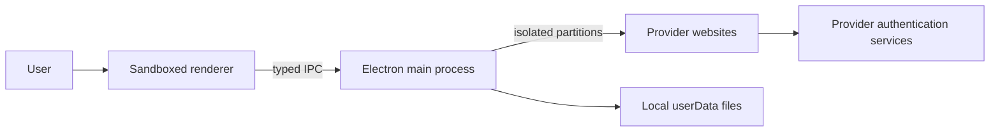

# Privacy and Security Model

AI Workspace is local-first, but it displays and automates third-party websites. This document
defines what the application does, what providers can still observe, and which guarantees are not
made.

## Data-flow summary

| Activity | Stored by AI Workspace | Sent to an AI Workspace server | Sent to provider |
| --- | --- | --- | --- |
| Account sign-in | Provider cookies in isolated Chromium partition | No | Credentials go directly to provider/auth site |
| Normal browsing | Provider-managed browser storage | No | Normal website traffic |
| Broadcast prompt | Local prompt history | No | Prompt and optional account context |
| Research response | Only when explicitly pasted/saved | No | Only if later sent by the user |
| GEO result | Captured locally for the active study | No | Imported questions |
| Usage analytics | Local durations/open/switch counts | No | No additional analytics payload |

AI Workspace does not run a telemetry, analytics, account, or synchronization backend.

## Trust boundaries

- The renderer is untrusted relative to privileged operating-system capabilities.
- The preload exposes a narrow typed API rather than raw Electron IPC.
- The main process validates renderer inputs.
- Provider websites are untrusted third-party content contained in sandboxed `WebContentsView`
  instances.
- Each account owns a persistent partition to prevent cookie and storage sharing.

## Local files

AI Workspace stores preferences, prompts, research content, GEO responses, and usage data in
Electron's `userData` directory. Exact paths vary by operating system.

These files:

- are not uploaded by AI Workspace;
- use serialized/atomic writes where implemented;
- may contain sensitive prompt or research content;
- are not encrypted by the application.

Use full-disk encryption, a protected operating-system account, and appropriate backup controls.

## Provider sessions

Passwords are entered into official provider or allowlisted authentication pages. AI Workspace
does not add them to application JSON.

Chromium session data can still contain authentication cookies. Anyone with sufficient access to
the local operating-system profile may be able to target that data. Removing an account clears its
local partition through Electron.

## Navigation controls

- external navigation must use HTTPS;
- provider surfaces allow only registered service and authentication hosts;
- unrelated links open in the operating-system browser;
- renderer popups are denied and opened externally;
- permission requests are limited to explicitly allowed capabilities and trusted service origins.

Allowlisting reduces accidental navigation exposure; it does not make a compromised provider
website trustworthy.

## Automation boundaries

### Broadcast

Broadcast inserts a prompt and activates provider controls. It does not read the resulting answer.

### Research Lab

Research Lab stores only responses explicitly pasted or edited by the user.

### GEO

GEO automatically captures responses only after a user creates and starts a supervised study. It
snapshots pre-existing answer nodes and accepts a new stable response generated for the current
question. It pauses rather than guessing when capture is uncertain.

## Sensitive-data detection

The renderer scans prompt text locally before selected outbound operations. Findings are masked in
warnings.

This is a best-effort pattern detector, not data-loss-prevention certification. It cannot
understand every secret, policy, jurisdiction, or proprietary term.

## Authentication limitations

Google can reject OAuth from embedded user agents. AI Workspace uses its native isolated Chromium
session across provider views and authentication popups, but does not import cookies, impersonate
an external browser, or weaken Google controls. Perplexity users should use its email verification
path when Google still rejects the embedded flow.

## Threats and mitigations

| Threat | Mitigation | Residual risk |
| --- | --- | --- |
| Cross-account session leakage | Dedicated persistent partition per account | Local OS compromise |
| Malicious renderer content | Sandbox, context isolation, no Node integration, narrow preload | Electron/Chromium vulnerability |
| Navigation to unrelated sites | HTTPS and host allowlists; external-browser handoff | Trusted provider compromise |
| Corrupt local write | Queued writes and temporary-file rename | Disk/OS failure |
| Accidental sensitive prompt | Local warning and explicit consent | False negatives and user override |
| Provider DOM change | Provider-specific adapters and visible failure states | Maintenance lag |
| Unattended automation | Sequential GEO execution and pause conditions | Provider policy/account enforcement |

## Security maintenance

- Keep Electron and npm dependencies current.
- Run `npm audit --audit-level=high` in CI.
- Review new host allowlist entries carefully.
- Never disable `contextIsolation`, renderer sandboxing, or web security for convenience.
- Do not add broad IPC channels or pass arbitrary code to provider views.
- Re-test authentication, Broadcast, and GEO after provider UI changes.

## Reporting

Do not publish vulnerability details in a public issue. Follow the private reporting process in
[`SECURITY.md`](../SECURITY.md).
