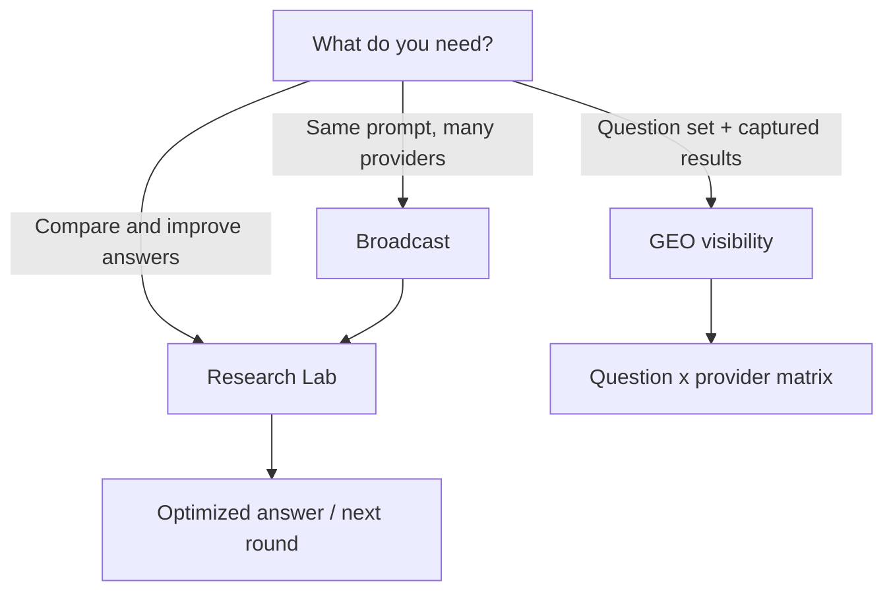
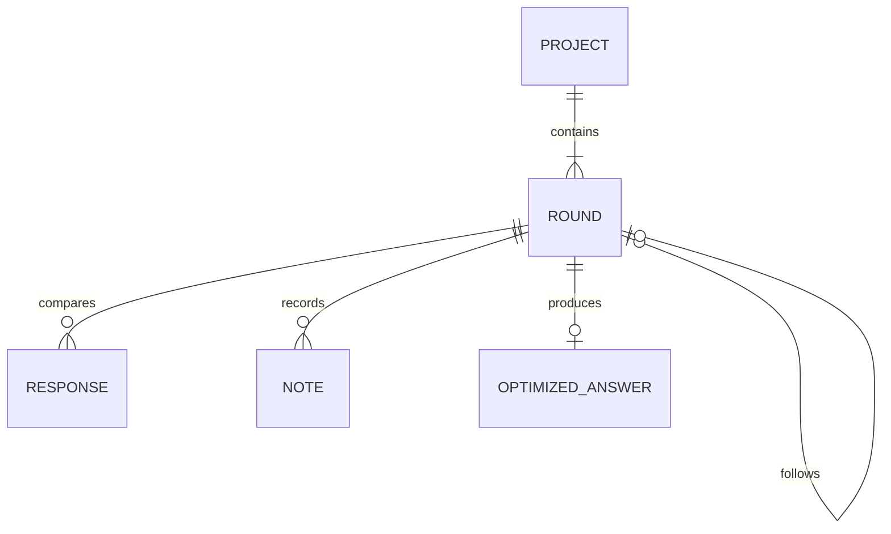

# Workflow Guide

AI Workspace separates general research from specialized use cases. This guide explains what
each workflow does, what it stores, and when to use it.

## Choose the right workflow

| Goal | Use |
| --- | --- |
| Ask one question in several subscriptions | Broadcast |
| Compare answers and create a stronger result | Research Lab |
| Continue an investigation through multiple iterations | Research Lab rounds |
| Run a controlled list of discovery questions | GEO visibility study |
| Reuse a structured prompt | Prompt templates |
| Repeat a prompt while the app is open | Scheduled prompts |



## Connect and switch accounts

1. Select **Add AI account**.
2. Choose a supported provider and give the local session a recognizable label.
3. Sign in on the official website loaded in the provider surface.
4. Open **Connected accounts** when you need to switch or remove a session.

Each account is isolated. Removing an account deletes its local Chromium partition and local
metadata; it does not delete the provider account.

### Google sign-in inside Perplexity

Google can block OAuth in embedded user agents. AI Workspace keeps **Continue with Google**
available and applies a consistent browser identity to provider views and their authentication
popups. If Google still rejects the attempt, enter the same Gmail address in Perplexity's email
field and follow its verification link instead.

Opening Google in the system browser is not enough because that browser's cookies cannot be
copied safely into the isolated Electron session.

## Broadcast

Broadcast delivers the same prompt to up to eight selected accounts.

### Modes

- **Standard:** uses the normal provider composer.
- **Deep Research:** attempts to activate the provider-specific research control. Availability
  depends on the provider, subscription, region, and current website UI.

### Data behavior

- Sensitive-data detection runs locally before delivery.
- Optional account context is appended only when enabled for that account.
- Delivery is serialized per account to avoid conflicting composer operations.
- The result describes delivery status, not the provider answer.
- Prompt history is stored locally.

### Statuses

| Status | Meaning |
| --- | --- |
| `submitted` | The adapter inserted the prompt and activated the send control. |
| `unsupported` | The requested mode or provider control was unavailable. |
| `failed` | Navigation, composer, or send interaction failed. |

## Prompt templates

Templates are local reusable prompts. Variables use this syntax:

```text
Compare {{product}} for {{audience}} in {{market}}.
Return strengths, risks, evidence gaps, and a recommendation.
```

Template values are previewed before use. Applying a template updates the Broadcast draft only
after explicit user action.

## Research Lab

Research Lab turns multiple answers into an iterative project.

### Project model



### Recommended process

1. Create a project with a clear objective.
2. Add the first research question.
3. Broadcast it or open providers manually.
4. Paste the relevant answers into provider response cards.
5. Mark the responses that should inform the optimization.
6. Record contradictions, missing evidence, and useful details in notes.
7. Generate the optimization prompt.
8. Edit it before sending; no hidden model writes it.
9. Save the improved answer.
10. Create a follow-up round when the result raises a new question.

Research Lab never scrapes a normal provider conversation automatically.

## GEO visibility studies

GEO is a supervised use case for observing how providers answer a repeatable question set.

### Import formats

#### Text

One question per line:

```text
What are the best tools for collaborative AI research?
Which AI workspaces support multiple providers?
How should a team compare answers from several LLMs?
```

#### CSV

Accepted question headers:

- `question`
- `domanda`
- `prompt`
- `query`

Optional category headers:

- `category`
- `topic`
- `categoria`

Example:

```csv
question,category
"What are the best tools for AI research?","discovery"
"Which products help compare LLM answers?","comparison"
```

Quoted fields, UTF-8 BOM, and duplicates are handled by the importer.

### Execution model

- one active GEO study globally;
- one question/provider pair at a time;
- 180-second capture timeout in Standard mode;
- 600-second capture timeout in Deep Research mode;
- pause on CAPTCHA, challenge pages, rate limits, unstable output, or uncertain capture;
- no unattended high-volume crawling.

### Result states

| State | Meaning |
| --- | --- |
| `pending` | Waiting to run |
| `sending` | Prompt is being inserted/submitted |
| `waiting` | Waiting for a new stable answer |
| `captured` | Answer captured automatically |
| `needs-review` | Content appeared but needs human validation |
| `blocked` | CAPTCHA, rate limit, or account condition blocked progress |
| `failed` | Adapter or page interaction failed |
| `skipped` | Intentionally excluded |

Manual correction changes the capture method to `manual` and removes automatically captured URLs
and citations so old sources cannot be attributed to new text.

### Operational guidance

- Start with 2-3 questions and 2 providers.
- Keep the provider windows authenticated before starting.
- Watch the first question on every provider after a website update.
- Use Deep Research with small batches.
- Review citations before using a result in reporting.
- Prefer official APIs for high-volume or unattended studies.

## Scheduled prompts

Schedules can be once, daily, or weekly. They run only while AI Workspace is open.

The schedule stores local wall-clock time plus the IANA time zone. The next occurrence is
recomputed after execution so daylight-saving transitions do not become a fixed UTC drift.

## Sensitive-data protection

The local scanner looks for common patterns such as credentials, email addresses, phone numbers,
payment-card-like values, and business-confidential markers.

Detection is advisory:

- it can produce false positives;
- it cannot find every sensitive value;
- masked findings are shown before sending;
- explicit consent is recorded for the exact protected payload where required.

Do not use the feature as a substitute for organizational data-handling policy.

## Recovery behavior

- Unsaved Research and GEO drafts participate in the app-close handshake.
- Active GEO batches are cancelled before shutdown.
- Results left in transient `sending` or `waiting` states are restored to a resumable state.
- Atomic stores wait for pending saves before the process exits.

## Troubleshooting

| Symptom | Action |
| --- | --- |
| Provider page changed | Reload, verify the composer manually, then retry a small Broadcast. |
| Deep Research unavailable | Use Standard mode or verify the subscription exposes that control. |
| GEO pauses | Open the provider, resolve CAPTCHA/account/rate-limit state, then resume. |
| Google rejects Perplexity login | Retry in normal Chrome/Edge to distinguish corporate policy; otherwise use Perplexity email verification with the same Gmail address. |
| Scheduled prompt did not run | Confirm the app was open and the schedule was enabled. |
| Interface is clipped | Reset with `Ctrl/Command+0`, then use the collapsible sidebar. |
